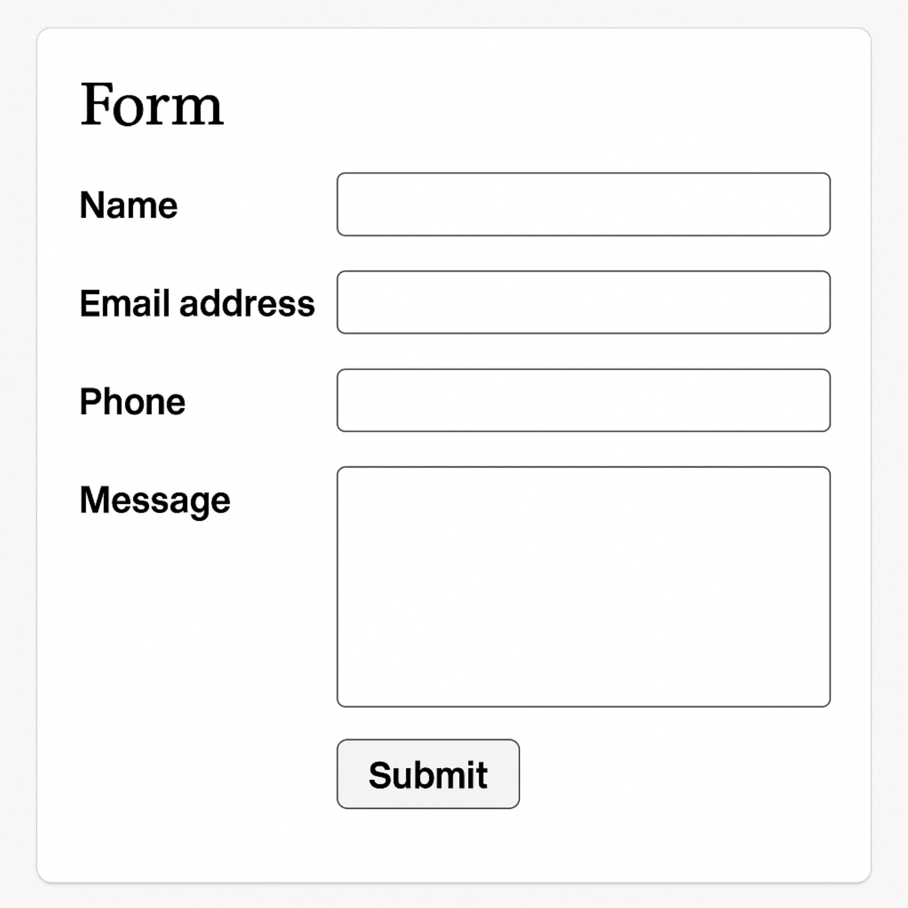

# Component: <!-- Give the component a descriptive, succinct name -->

## Description

<!-- Brief description of what this component is and its primary function -->

Contact form with error messaging

## Selector

<!-- CSS or JS selector -->

```css
.container .form.contact
```

## Visual Reference

<!-- Reference to screenshot in the `./_assets directory` -->



## Notes

<!-- Other useful notes and considerations, like steps to reproduce, etc. -->
